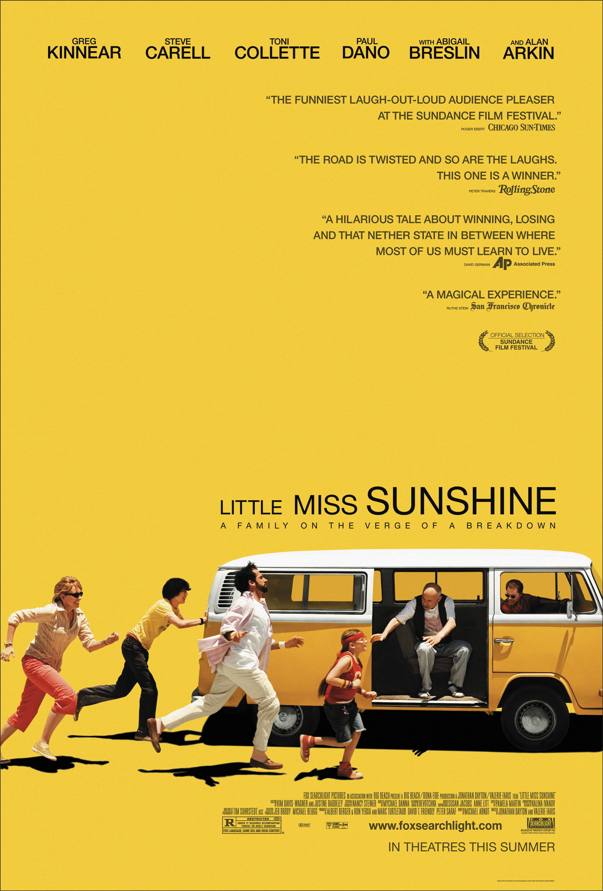
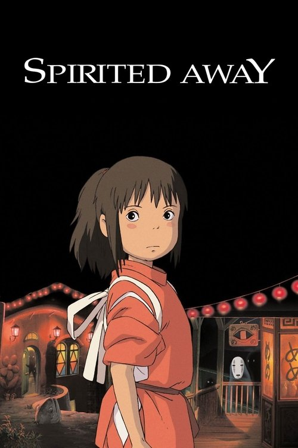
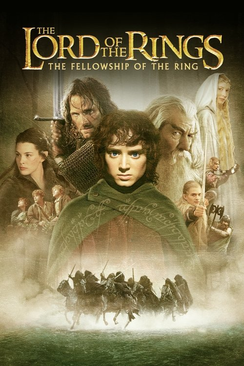

<p align="center">
  
</p>

<p align="center">
  
  
  
</p>

<p align="center">
  <a href="#-the-moods">The Moods</a> •
  <a href="#-key-features">Key Features</a> •
  <a href="#-vibe-gallery">Vibe Gallery</a> •
  <a href="#-getting-started">Getting Started</a> •
  <a href="#-project-architecture">Architecture</a>
</p>

<p align="center">
  
</p>

## 📖 Introduction

**MoodFlix** is a serverless, interactive web application designed to recommend movies based on your current emotional state. Whether you want to boost a happy mood, dive into an intense thriller, or relax with a comforting chill vibe, MoodFlix uses a lightweight client-side filter engine to curate the perfect watchlist instantly.

Built entirely using **Vanilla HTML5, CSS3, and JavaScript**, the app demonstrates responsive design, clean modular components, and polished micro-animations.

<p align="center">
  
</p>


MoodFlix categorizes recommendations into six distinct emotional palettes, designed to fit your current state of mind:

| Mood | Vibe Tagline |
| :---: | :--- |
| **☀️ Happy** | Wholesome, feel-good films to lift your spirits and make you smile. |
| **🌧️ Sad** | Deep, emotional stories with heart and poignant narrative arcs. |
| **🔪 Thriller** | High-stakes suspense, mysteries, and jaw-dropping plot twists. |
| **💫 Romantic** | Lighthearted, cozy, and heartwarming tales of connection. |
| **🌙 Chill** | Relaxing, easy-going movies to help you wind down after a long day. |
| **⚡ Adventurous** | Action-packed exploration, fantasy quests, and epic journeys. |

<p align="center">
  
</p>


### 🎬 **Smart Recommendation Engine**
- Filters and loads customized movie recommendations dynamically upon clicking a mood.
- Displays rich media cards showing movie titles, release years, genre tags, platform availability (Netflix, Prime Video, YouTube), and concise summaries.

### 🔔 **Polished UI & Micro-Animations**
- Custom-designed glassmorphism components with soft gradient backgrounds.
- Responsive navigation bar with active scrolling shadow effects and a modular mobile hamburger menu.
- Smooth transitions and hover animations on the interactive mood selector cards.

<p align="center">
  
</p>


Here is a visual preview of some premium movie recommendations you will discover:

<p align="center">
  
  
  
</p>

<p align="center">
  
</p>


Getting MoodFlix running locally on your computer takes less than 5 seconds.

### **Run Instantly:**
1. Clone or download this repository to your computer.
2. Locate the file **`index.html`** in the root folder.
3. **Double-click `index.html`** to launch the platform instantly in your browser!

> [!TIP]
> **VS Code Live Server:** For the absolute best development experience (complete with hot-reloading and accurate responsiveness testing), right-click `index.html` and select **Open with Live Server**.

<p align="center">
  
</p>


The exact repository files and directory layout are structured as follows:

```
Moodflix/
├── .gitignore              ← Git ignore configuration rules
├── HOW_TO_RUN.txt          ← Plaintext quick-start usage guidelines
├── LICENSE                 ← Project open-source license permissions
├── README.md               ← Project documentation (this file)
├── index.html              ← Main HTML document skeleton and UI container
├── assets/
│   ├── divider.svg         ← Animated gradient divider line
│   ├── logo.svg            ← Animated text logo
│   ├── header-moods.svg        ← Animated section header (The Moods)
│   ├── header-features.svg     ← Animated section header (Key Features)
│   ├── header-gallery.svg      ← Animated section header (Vibe Gallery)
│   ├── header-start.svg        ← Animated section header (Getting Started)
│   ├── header-architecture.svg ← Animated section header (Architecture)
│   ├── header-walkthrough.svg  ← Animated section header (Walkthrough)
│   ├── header-contributors.svg  ← Animated section header (Contributors)
│   └── posters/            ← Local movie poster image repository (.jpg)
├── css/
│   ├── components.css      ← Toast banners & movie recommendation card layout
│   ├── layout.css          ← Core grid layout, header, footer, & navigation bar
│   ├── mood-picker.css     ← Mood selection grid, glassmorphic cards, and hover FX
│   └── variables.css       ← Theme colors, custom design tokens, and root styles
└── js/
    ├── components.js       ← Dynamic HTML template parsing & DOM element factories
    ├── layout.js           ← Mobile navigation drawer handler & navbar scroll shadow
    ├── mood-engine.js      ← Main recommendations filter & alert handlers
    └── movie-data.js       ← Local structured movie list object database
```

<p align="center">
  
</p>


Experience all the features of MoodFlix by trying these quick steps:

1. **Scroll Reveal**: Click the **Pick your mood** CTA button in the hero banner. The viewport will scroll smoothly to the interactive grid.
2. **Select Vibe**: Select **Happy** or **Thriller**. Watch the movie recommendation container slide into view.
3. **Mobile Layout**: Open DevTools (`F12`), switch to mobile view, and tap the hamburger icon to toggle the slide-out navigation menu.

<p align="center">
  
</p>


<table align="center" style="border-collapse: collapse; border: none; margin-top: 20px;">
  <tr style="border: none;">
    <td align="center" style="border: none; padding: 20px; width: 220px;">
      <a href="https://github.com/Dhruvi-tech">
        <br />
        <strong style="font-size: 16px; color: #3b82f6;">Dhruvi Mittal</strong>
      </a>
    </td>
    <td align="center" style="border: none; padding: 20px; width: 220px;">
      <a href="https://github.com/Archana4413">
        <br />
        <strong style="font-size: 16px; color: #ec4899;">Archana</strong>
      </a>
    </td>
    <td align="center" style="border: none; padding: 20px; width: 220px;">
      <a href="https://github.com/gedilabimalabsc24-code">
        <br />
        <strong style="font-size: 16px; color: #10b981;">Gedila Bimala</strong>
      </a>
    </td>
  </tr>
</table>
